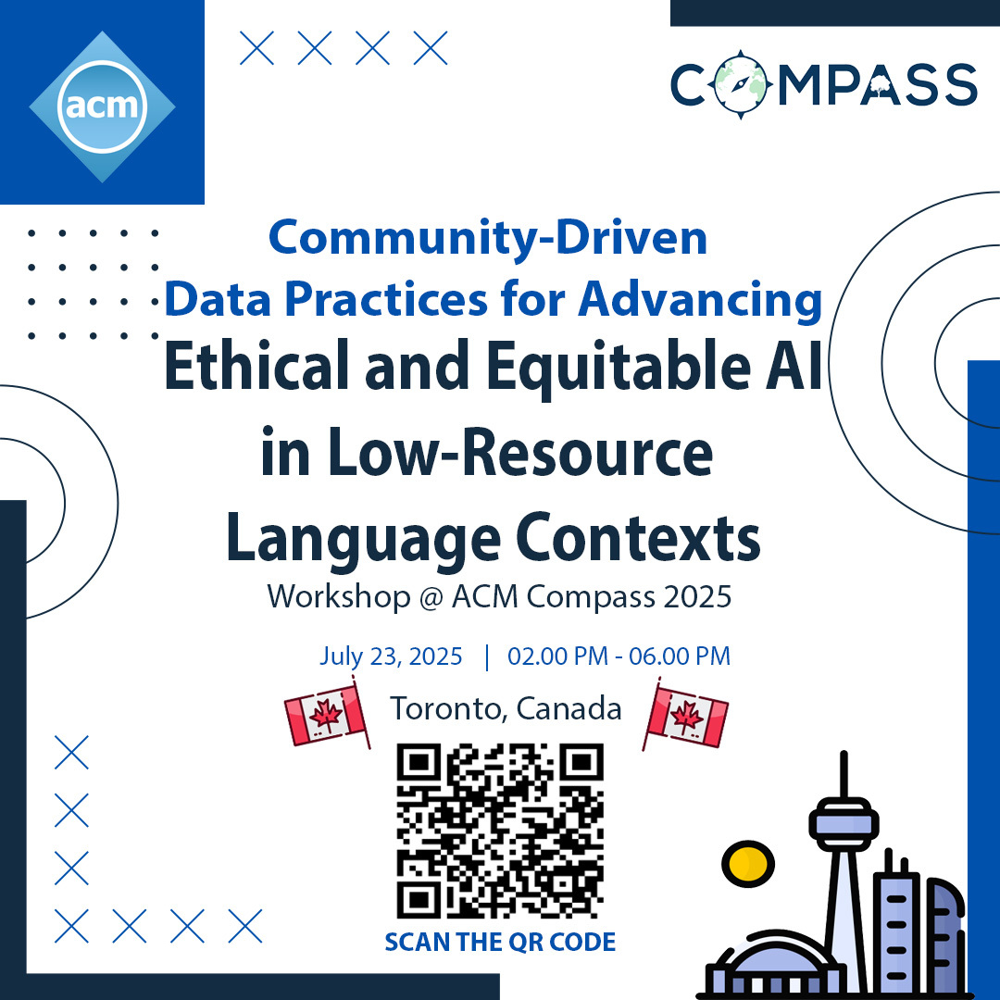

# Community-Driven Data Practices for Advancing Ethical and Equitable AI in Low-Resource Language Contexts

The collection of low-resource language data for AI technology development has always remained difficult, but the exponentially increasing need for data for the current paradigm of training large language models can further marginalize these languages. Even with some community-driven data collection methods developed, there are various ethical issues to be considered, given that many of these languages are spoken in the Global South, where such technology development might not always benefit, or could even be potentially harmful to the communities.

This workshop invites researchers with diverse experiences---including but not limited to community-based research, low-resource language technology development, data collection and analysis---as well as practitioners, developers, and community representatives to join us in discussing potential pathways for community-driven data practices for low-resource language technologies and the ethical challenges associated with them. Our goal is for this workshop to serve as a platform for sharing ideas and fostering collaboration.

If you are interested in attending, please fill out this [Google Form](https://docs.google.com/forms/d/e/1FAIpQLSeVRpt8es1aMK1g-35oEyhBcJ3WHsEnPgtY0-8gL7hau0u1Jw/viewform?usp=header) to help us prepare.

For more details, you can read our full [workshop proposal](assets/COMPASS_25__Workshop_Proposal.pdf).

## Workshop Schedule

The workshop is scheduled on **July 23rd (Wednesday) from 2:00 PM to 5:00 PM**. It will be held hybrid, in-person in Toronto and online on Zoom. Please refer to the COMPASS 2025 website for details on the in-person location.

All times are Eastern Time (ET).

| Time | Activity |
|-------|--------|
| 2:00-2:30 PM | Welcome, quick introductions, and ice-breaker ideation session |
| 2:30-3:30 PM | Panel discussion |
| 3:30-3:45 PM | Break |
| 3:45-4:45 PM | Breakout sessions: small-group discussions on case studies |
| 4:45-5:15 PM | Report-back and synthesis |
| 5:15-6:00 PM | Closing, next steps, and open networking |

## Panelists

- Julia Kreutzer: Senior Research Scientist, Cohere Labs
- Monojit Choudhury: Professor of Natural Language Processing, MBZUAI
- Vera Khovanskaya: Assistant Professor, University of Toronto

## Organizers

- Charles Nimo (Georgia Institute of Technology)
- Shuheng Liu (Georgia Institute of Technology)
- Amy Z. Chen (Georgia Institute of Technology)
- Ramaravind Kommiya Mothilal (University of Toronto)
- Michael L. Best (Georgia Institute of Technology)

You can reach out to us at comdataworkshop@gmail.com.
